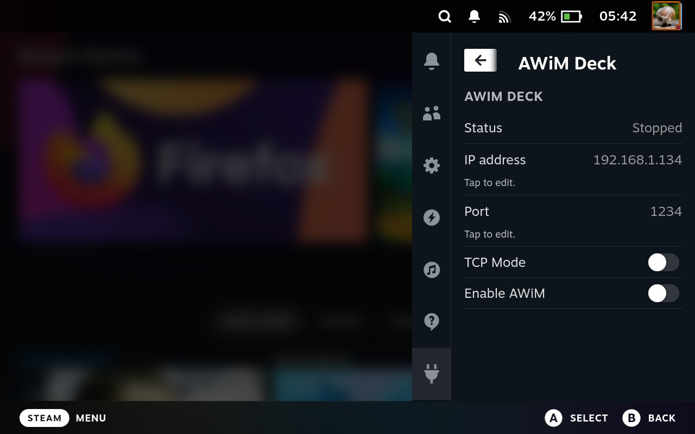

# AWiM Deck
AWiM Deck is a Decky Loader plugin that runs [awim-client](https://github.com/rotlir/awim-client) on Steam Deck and lets you use your Android phone as a wireless microphone.

## Screenshot


## Quick Start

### 1) Download apps
- Steam Deck plugin: [AWiM Deck releases](https://github.com/ergolyam/awim-deck/releases)
- Phone server: [AWiM Server releases](https://github.com/rotlir/awim-server/releases)  

### 2) On phone
1. Install `awim-release.apk`.
2. Open **AWiM**.
3. Grant microphone and notification permission.
4. Optionally enable **TCP mode**.
5. Tap **Start AWiM**.
6. Keep the app open and note the shown `IP:port` (text like `AWiM running on 192.168.x.x:1242`).

### 3) On Steam Deck
1. In Decky Loader, enable Developer mode if needed.
2. Install the downloaded `awim-deck-v*.zip` from releases.
3. Wait for Decky to download the remote `awim` binary on install/update.
4. If Decky reports remote binary download failure, check network and reinstall.
5. Open the **AWiM Deck** plugin panel.
6. Set **IP address** and **Port** to the values shown in the phone app.
7. Set **TCP Mode** to match the phone app mode.
8. Toggle **Enable AWiM** on.
9. Confirm status changes from `Stopped` to waiting/connected state.

## How To Use
1. Connect Steam Deck and phone to the same Wi-Fi network.
2. Start AWiM on phone first.
3. Start AWiM Deck in plugin UI (`Enable AWiM` toggle).
4. In your game or voice app, select the AWiM virtual microphone source.
5. To stop streaming, toggle `Enable AWiM` off on Deck and press `Stop AWiM` on phone.

### Steam Deck Voice Input (Gamescope)
- You can also set microphone input globally in Steam Deck UI:
    - open `Settings -> Audio -> Voice`;
    - set `Input Device` to `AWiM-source`.

- Notes:
    - sometimes `Input Device` stays on `Default`, and AWiM still gets selected automatically when AWiM starts;
    - if automatic selection does not work, switch to Desktop Mode and try setting default input device in KDE audio settings;
    - behavior may vary between systems, but after selecting `AWiM-source` once in Gamescope, many users see it auto-selected on next restarts.

## Build / Assembly

### Requirements
- `nodejs`
- `pnpm`
- `python3`

### Remote binary source
- Decky `remote_binary` downloads `bin/awim` from:
  - `https://github.com/ergolyam/awim-client/releases/download/v0.1.1/awim-glibc-x86_64`

### Build from source
```bash
git clone https://github.com/ergolyam/awim-deck.git
cd awim-deck
pnpm install
pnpm run build
```

#### After build:
- packaged plugin zip: `out/awim-deck-v<version>.zip`
- staging directory: `out/awim-deck/`

## Upstream Projects
- [awim-client fork](https://github.com/ergolyam/awim-client) (fork of upstream awim-client)
- [awim-client upstream](https://github.com/rotlir/awim-client) (original Linux/PipeWire client)
- [awim-server](https://github.com/rotlir/awim-server) (Android server app)

## License
GPL-3.0-only. See [LICENSE](license).
